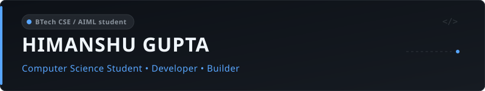

  

  

  Building practical software across React, backend development, and web.

  <a href="https://github.com/Himanshu102931">@Himanshu102931</a>

---

## About

I'm Himanshu, a BTech CSE / AIML student building practical software for the web. I focus on developing clean React interfaces, working with backend services, and learning DSA to write better code. I enjoy turning ideas into working practical projects that solve everyday problems.

**Focus:** `React` · `Backend Development` · `DSA` · `Practical software projects`

---

## Now

- **Building:** Interactive web applications and browser-based projects
- **Learning:** Backend development and DSA
- **Exploring:** Databases, deployment, and cloud tools

---

## Tech Stack

**Languages:** `TypeScript` · `JavaScript` · `Python` · `C++`

**Frontend:** `React` · `HTML` · `CSS` · `Tailwind CSS`

**Backend:** `Node.js` · `Express` · `REST APIs`

**Tools:** `Git` · `GitHub` · `Vite` · `VS Code`

---

## Featured Projects

<table width="100%">
  <tr>
    <td width="50%" valign="top">
      <h4><a href="https://github.com/Himanshu102931/OS">OS</a></h4>
      
Interactive desktop interface and multi-window workspace in the browser.

      
<code>TypeScript</code> · <a href="https://os-snowy-delta.vercel.app">Demo</a> · <a href="https://github.com/Himanshu102931/OS">Repository</a>

    </td>
    <td width="50%" valign="top">
      <h4><a href="https://github.com/Himanshu102931/cloud-file-storage">Cloud File Storage</a></h4>
      
Cloud storage service with user authentication and file management.

      
<code>Python</code> · <a href="https://github.com/Himanshu102931/cloud-file-storage">Repository</a>

    </td>
  </tr>
  <tr>
    <td width="50%" valign="top">
      <h4><a href="https://github.com/Himanshu102931/pomodoro">Pomodoro Timer</a></h4>
      
Study and productivity timer with customizable work-break intervals.

      
<code>TypeScript</code> · <a href="https://github.com/Himanshu102931/pomodoro">Repository</a>

    </td>
    <td width="50%" valign="top">
      <h4><a href="https://github.com/Himanshu102931/limecraft">Limecraft</a></h4>
      
Voxel world experiment running in the browser.

      
<code>TypeScript</code> · <a href="https://github.com/Himanshu102931/limecraft">Repository</a>

    </td>
  </tr>
</table>

---

## GitHub Stats

  <picture>
    <source media="(prefers-color-scheme: dark)" srcset="https://github-readme-stats.vercel.app/api?username=Himanshu102931&amp;show_icons=true&amp;bg_color=21262D&amp;border_color=30363D&amp;border_radius=10&amp;icon_color=58A6FF&amp;text_color=C9D1D9&amp;title_color=58A6FF" />
    <source media="(prefers-color-scheme: light)" srcset="https://github-readme-stats.vercel.app/api?username=Himanshu102931&amp;show_icons=true&amp;bg_color=21262D&amp;border_color=30363D&amp;border_radius=10&amp;icon_color=58A6FF&amp;text_color=C9D1D9&amp;title_color=58A6FF" />
    
  </picture>

---

## Streak

  <picture>
    <source media="(prefers-color-scheme: dark)" srcset="https://streak-stats.demolab.com?user=Himanshu102931&amp;background=21262D&amp;border=30363D&amp;stroke=30363D&amp;ring=58A6FF&amp;fire=58A6FF&amp;currStreakNum=58A6FF&amp;currStreakLabel=58A6FF&amp;sideLabels=C9D1D9&amp;sideNums=C9D1D9&amp;dates=C9D1D9" />
    <source media="(prefers-color-scheme: light)" srcset="https://streak-stats.demolab.com?user=Himanshu102931&amp;background=21262D&amp;border=30363D&amp;stroke=30363D&amp;ring=58A6FF&amp;fire=58A6FF&amp;currStreakNum=58A6FF&amp;currStreakLabel=58A6FF&amp;sideLabels=C9D1D9&amp;sideNums=C9D1D9&amp;dates=C9D1D9" />
    
  </picture>

---

## Top Languages

  <picture>
    <source media="(prefers-color-scheme: dark)" srcset="https://github-readme-stats.vercel.app/api/top-langs/?username=Himanshu102931&amp;layout=compact&amp;bg_color=21262D&amp;border_color=30363D&amp;border_radius=10&amp;icon_color=58A6FF&amp;text_color=C9D1D9&amp;title_color=58A6FF" />
    <source media="(prefers-color-scheme: light)" srcset="https://github-readme-stats.vercel.app/api/top-langs/?username=Himanshu102931&amp;layout=compact&amp;bg_color=21262D&amp;border_color=30363D&amp;border_radius=10&amp;icon_color=58A6FF&amp;text_color=C9D1D9&amp;title_color=58A6FF" />
    
  </picture>

---

## Snake

Snakes eat my commits.

---

## Find me

  
  &nbsp;
  

